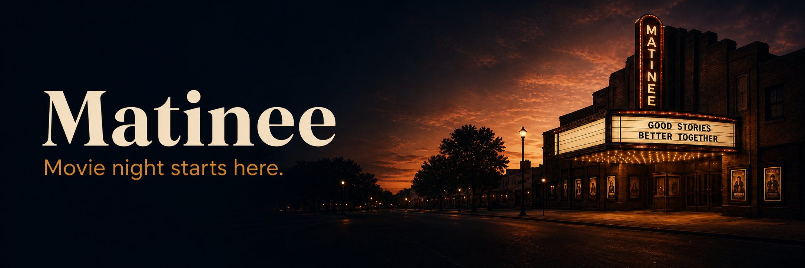
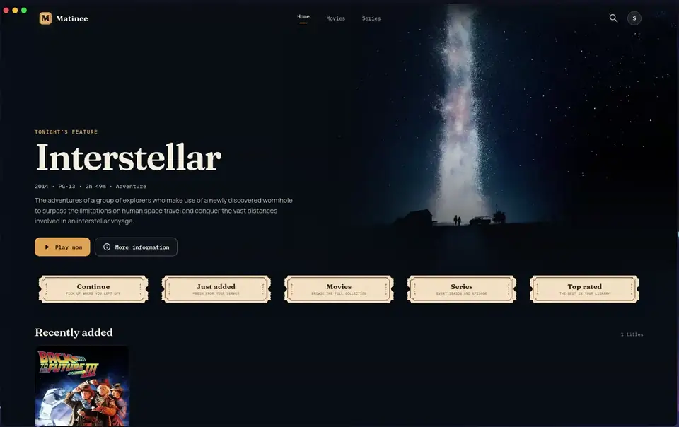

# Matinee — Your Jellyfin library, dressed for movie night

<p align="center">
  
</p>

[](https://github.com/kernastra/matinee/actions/workflows/ci.yml)
[](https://github.com/kernastra/matinee/actions/workflows/security.yml)
[](https://github.com/kernastra/matinee/releases/latest)
[](LICENSE)
[](https://v2.tauri.app/)
[](https://react.dev/)

## Overview

Matinee is a standalone desktop client for personal [Jellyfin](https://jellyfin.org/) libraries. It pairs Jellyfin's media server and playback APIs with a warm, cinema-inspired interface designed for the couch: rich artwork, editorial home sections, focused title pages, custom playback controls, and a built-in studio for creating collector-style library artwork. Matinee connects to your existing server and library; it does not replace or bundle Jellyfin itself.

> **Status:** `v0.5.6` early release. Matinee is actively developed and packaged for x86_64 Linux; Windows and macOS builds have not yet been validated.

## Demo

<p align="center">
  <a href="docs/assets/matinee-demo.mp4">
    
  </a>
</p>

<p align="center"><sub>The preview loops automatically. Select it to open the full MP4.</sub></p>

## Features

- 🎬 **Cinematic Jellyfin browsing** — Explore rotating hero artwork, editorial shelves, dedicated movie and series libraries, search, seasons, and episodes
- ▶️ **Native-feeling playback** — Direct play or HLS transcoding with resume support, quality selection, audio and subtitle controls, seeking, volume, and fullscreen
- 🍿 **Rich title pages** — Browse cast, related titles, collections, chapters, technical media details, watchlist state, and played status
- 📅 **Personal release calendar** — Connect Radarr or Sonarr to see only monitored movie milestones and upcoming episodes, plus an optional Coming Soon shelf
- 🎨 **Guided Poster Studio** — Generate coordinated posters, backdrops, banners, and thumbnails with four approachable creative choices instead of prompt writing
- 🧬 **Movie-specific art direction** — Combine Jellyfin metadata and optional `movie.mf.json` manifests with Matinee's palette, typography, texture, and composition system
- 🖼️ **Persistent custom artwork** — Assign generated posters throughout Matinee, export them to Pictures, or save approved movie artwork beside local media as `poster.jpg`
- 🔌 **Choice of image providers** — Use an authenticated local Codex CLI or a fal.ai API key stored in the operating-system credential vault
- ⚙️ **Personalized movie night** — Save playback preferences, autoplay, hero timing, reduced motion, artwork labels, integrations, and image-provider settings locally
- 🖥️ **Desktop-first experience** — Run in a frameless Tauri window with custom chrome, a branded system tray, bundled typography, and Material Symbols

## Tech Stack

| Component | Technology |
|-----------|------------|
| **Desktop shell** | Tauri 2, Rust |
| **Interface** | React 19, TypeScript |
| **Build tooling** | Vite 7, pnpm |
| **Playback** | HTML5 video, hls.js, Jellyfin REST API |
| **Image generation** | Local Codex CLI, fal.ai FLUX/FLUX 2 Edit |
| **Native services** | Rust, OS credential vault, local artwork persistence |
| **Styling** | Hand-authored CSS, bundled fonts, Material Symbols |
| **Tests** | Vitest, jsdom, Rust test harness |

## Getting Started

### Prerequisites

- **Jellyfin server** — A running server reachable from the computer using Matinee
- **Node.js 20 or newer** — Required when running from source
- **pnpm 10 or newer** — Required when running from source
- **Stable Rust toolchain** — Required when running from source
- **Tauri platform dependencies** — Follow the official [Tauri prerequisites](https://v2.tauri.app/start/prerequisites/) for your operating system
- **Codex CLI or fal.ai key** — Optional; needed only for Poster Studio image generation

On Fedora, install the current Tauri Linux dependencies with:

```bash
sudo dnf check-update
sudo dnf install webkit2gtk4.1-devel \
  openssl-devel \
  curl \
  wget \
  file \
  libappindicator-gtk3-devel \
  librsvg2-devel \
  libxdo-devel
sudo dnf group install "c-development"
```

### Installation

Download the AppImage, Debian package, or RPM from the
[latest GitHub release](https://github.com/kernastra/matinee/releases/latest).

To run Matinee from source instead:

```bash
git clone https://github.com/kernastra/matinee.git
cd matinee
pnpm install
pnpm tauri:dev
```

### Configuration

No environment file is required. On first launch, enter the root URL of your Jellyfin server—such as `http://jellyfin.local:8096`—followed by your Jellyfin username and password.

Radarr, Sonarr, and image-provider credentials are configured inside **Settings**. Matinee stores managed API keys in the operating-system credential vault rather than the repository or browser storage.

If Jellyfin runs in Docker or reports paths that differ from the host filesystem, open **Settings → Media storage** and map each Jellyfin prefix to an existing local folder—for example, `/media` → `/mnt/media`. Trusted roots constrain where Matinee may read `movie.mf.json` or save approved artwork.

## Usage

1. Start Matinee with `pnpm tauri:dev`.
2. Enter the full Jellyfin server address, including `http://` or `https://`, and sign in.
3. Browse the home screen or use Movies, Series, and Search to find a title.
4. Open a title for its details, then select Play or Resume. For a series, choose a season and episode first.
5. Move the pointer over the player to reveal its controls. They fade away after five seconds of inactivity.

### Follow monitored releases

1. Open **Settings → Coming soon**.
2. Enter the root address and API key for Radarr, Sonarr, or both, then select **Test & save**.
3. Open **Calendar** from the main navigation. The destination appears whenever at least one release integration is configured.
4. Use **All**, **Movies**, or **Series** to filter the agenda and month grid. Radarr movies retain separate theatrical, digital, and physical milestones.
5. Select **Refresh** to bypass the short request cache and request current monitored dates from each connected service.

Matinee reads release information only. It does not add, remove, monitor, search for, or download media, so any compatible request service can continue feeding Radarr and Sonarr independently.

### Create a custom poster

1. Open the profile menu and select **Poster Studio**.
2. When using ChatGPT, open **Settings → Image generation** and scan once for the authenticated local Codex CLI. Matinee pins that verified executable until you scan again.
3. Choose a movie or series from the connected Jellyfin library.
4. Select an asset type, focus, title-specific subject, and text treatment. Matinee assembles the full creative brief behind the scenes.
5. Select **Generate poster**. A completed poster is assigned to that title inside Matinee automatically.
6. Export a normal copy to Pictures, or—for movies whose Jellyfin file resolves to a trusted local media folder—save it as `poster.jpg` beside the media.

Poster Studio works from normal Jellyfin metadata when no creative manifest is available. For richer options, place a version-1 `movie.mf.json` in the movie folder. Matinee reads only the selected title's manifest; it does not independently scan or index the media library.

The **Advanced** panel exposes the assembled prompt, permits an editable copy or complete custom brief, and imports `.txt`, `.md`, and prompt-bearing `.json` files. Matinee styling can be kept or disabled for a custom prompt.

<!-- ===== Repo-Specific Sections ===== -->

## Local-First Scope

Matinee connects directly to services you configure and keeps its preferences, custom artwork assignments, generated images, and retained diagnostics on your computer. Jellyfin credentials remain session-scoped, while Radarr, Sonarr, and fal.ai keys are stored through the operating system's credential vault.

Poster Studio makes one provider request per deliberate generation attempt and never silently retries a rejected image. Codex jobs run in a restricted temporary workspace, successful job files are cleaned up automatically, and failed diagnostics are retained locally for seven days to support troubleshooting.

## Development

| Command | Purpose |
| --- | --- |
| `pnpm tauri:dev` | Run the Vite frontend inside the Tauri desktop shell |
| `pnpm dev` | Run the frontend development server on port 1421 |
| `pnpm typecheck` | Check the TypeScript project without emitting files |
| `pnpm test` | Run the Vitest test suite once |
| `pnpm build` | Type-check and create the production frontend bundle |
| `pnpm audit:web` | Check shipped web dependencies for known advisories |
| `pnpm audit:rust` | Check the native dependency graph after installing `cargo-audit` |
| `pnpm tauri:build` | Build installable desktop bundles for the current platform |

Every pull request runs the interface type-check, tests, production build, Rust formatting check, and native test suite. Tags matching the package version—such as `v0.6.0`—build AppImage, Debian, and RPM bundles and publish them in a GitHub release.

The visual direction, component rules, interaction patterns, and Matinee color tokens live in [docs/design-spec.md](docs/design-spec.md). Poster generation uses the machine-readable house style in [`src/data/matinee-poster-style.json`](src/data/matinee-poster-style.json) and the prompt architecture documented in [docs/poster-prompt-templates.md](docs/poster-prompt-templates.md).

## Project Structure

```text
src/
├── assets/              Branded artwork, fonts, and Material Symbols
├── components/          Navigation, library, playback, settings, and Poster Studio UI
├── data/                Versioned Matinee poster-style manifest
├── lib/                 Jellyfin, settings, generation, manifest, and prompt helpers
├── App.tsx              Application routing and session orchestration
└── styles.css           Shared Matinee design system and component styles
src-tauri/
├── src/                 Native shell, image providers, keyring, and local-file commands
└── tauri.conf.json      Window, security, and bundle configuration
docs/
├── assets/              README and documentation artwork
├── design-spec.md       Product-specific visual and interaction specification
└── poster-prompt-templates.md  Poster prompt architecture and genre recipes
```

## Platform Notes

- Linux is the primary development and testing platform today. The Tauri configuration can produce other desktop targets, but macOS and Windows builds have not yet been validated.
- Matinee uses the system WebView. On Linux that means WebKitGTK 4.1; codec availability can vary by distribution.
- The `tauri:dev` and `tauri:build` scripts include renderer and AppImage compatibility flags used by the current Fedora development environment.

## Known Limitations

- Login state is stored for the current app session, so a full restart may require signing in again.
- Calendar dates depend on the metadata available in Radarr and Sonarr. A monitored title with no future release or air date will not appear until its upstream metadata is updated.
- Trailer playback remains unavailable until Jellyfin provides a supported trailer source. The More menu is available for playback, media, watchlist, played-state, progress, and title-copy actions.
- Chapter navigation works whenever Jellyfin returns chapters; preview artwork requires chapter-image extraction to be enabled and completed on the Jellyfin server.
- Playback compatibility ultimately depends on the source media, server-side FFmpeg setup, enabled Jellyfin transcoding, and codecs supported by the system WebView.
- Image generation requires a separately authenticated provider and remains subject to that provider's availability, billing, safety systems, and acceptable-use policy. A rejected generation is not retried automatically.
- Higgsfield can be selected and configured, but generation remains disabled until Matinee adopts a stable documented developer endpoint.
- `movie.mf.json` discovery and direct `poster.jpg` export require a Jellyfin path that resolves through **Settings → Media storage**. Remote-only libraries fall back to Jellyfin metadata and normal image export.
- AI-rendered title text may be misspelled. Use **No Text** or the Advanced workflow when deterministic typography is required.
- Linux packages are produced for x86_64 systems. Windows and macOS releases have not yet been validated.

## Troubleshooting

### Matinee cannot connect to Jellyfin

Use the server's root address—not a browser page such as `/web/index.html`—and include the URL scheme and port when required. Confirm that the same address opens from the computer running Matinee.

### Playback does not start

First test the same title in Jellyfin's official web client. If it also fails there, check the server's FFmpeg configuration and transcoding permissions. If it succeeds, inspect the Matinee development console and Jellyfin server logs to see whether direct play or an HLS transcode was selected.

### Port 1421 is already in use

An earlier Vite process may still be running after the desktop window closes. Identify the process before stopping it:

```bash
ss -ltnp 'sport = :1421'
kill <pid>
pnpm tauri:dev
```

### The Linux window is blank or transparent

Launch with `pnpm tauri:dev` rather than invoking `tauri dev` directly. The project script sets the WebKit renderer compatibility flag used by Matinee.

### Poster generation is unavailable

Open Settings → Poster generation. For ChatGPT/Codex, install and authenticate the local Codex CLI, then run Matinee's provider scan. For fal.ai, add a valid API key; it is saved to the operating-system credential vault.

### A poster is rejected by the image provider

Provider safety and content-policy checks can reject either a prompt, a reference image, or the generated output. Try a more symbolic **Auto**, **Signature Element**, **Scene**, or **Environment** focus, correct overly broad Movie DNA, or select another configured provider. Matinee deliberately makes one attempt and does not bypass provider safeguards.

### Matinee cannot save `poster.jpg`

The selected Jellyfin movie must expose a media-file path that resolves on the same computer. If Jellyfin runs in Docker, make sure its `/media`, `/movies`, `/tv`, or `/shows` mount corresponds to a local media folder Matinee can access. Export to Pictures remains available when direct media-folder export is not.

### Calendar is missing or reports an unavailable integration

Calendar remains hidden until Radarr or Sonarr passes **Test & save** in Settings. Use the service's root address, including `http://` or `https://` and its port, then confirm the API key under the service's general settings. If one integration is offline, Matinee keeps showing results from the other and marks the unavailable service in the Calendar status row.

## License

Matinee is licensed under the [MIT License](LICENSE).
